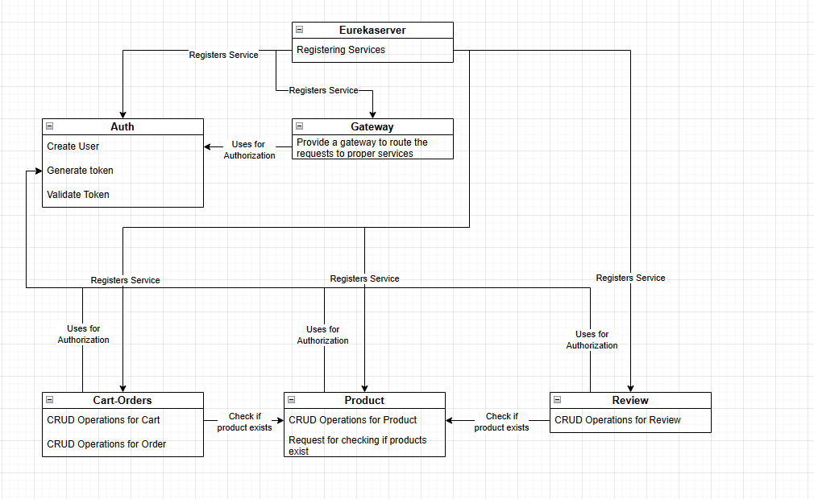
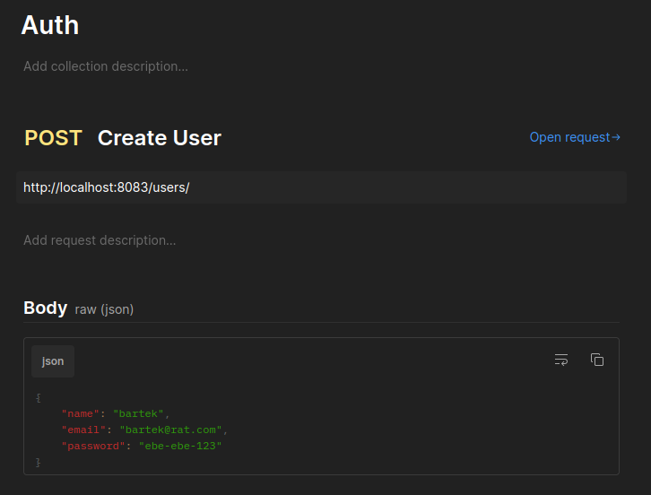
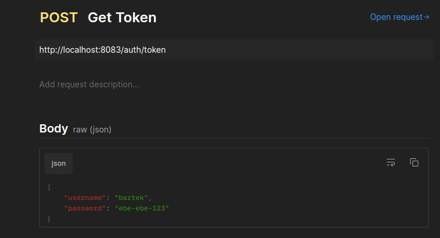
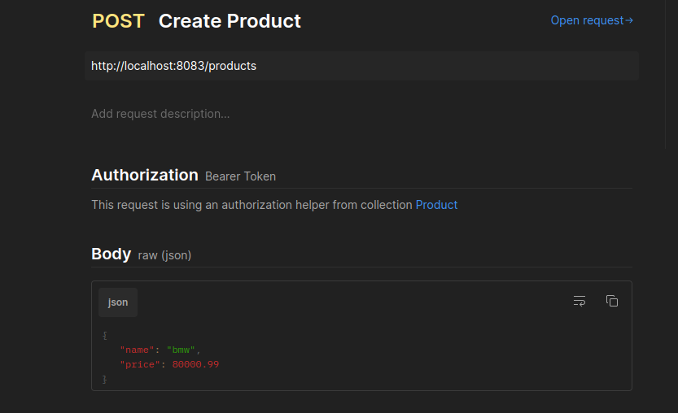
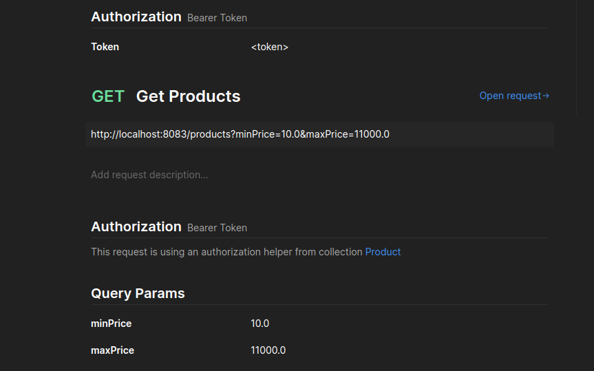
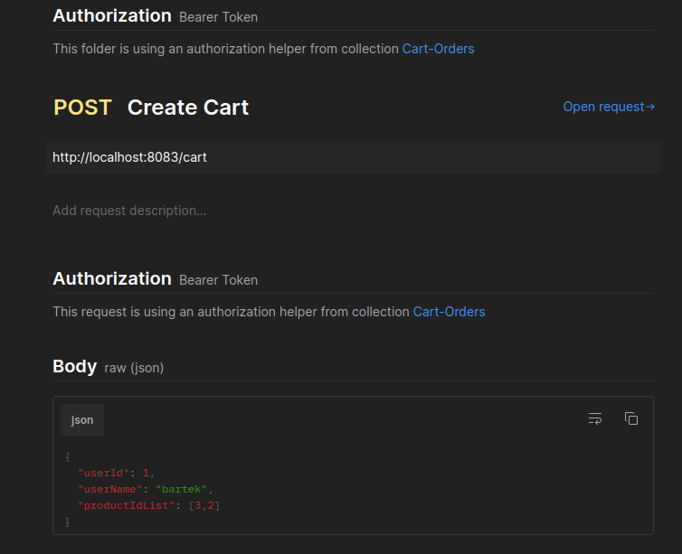
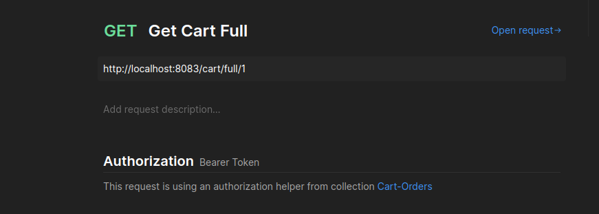

# Microservices Project

This project was developed as part of a microservices course. It demonstrates the implementation of various microservices, each with specific functionalities, and their orchestration using Docker and Docker Compose.

## Microservices

1. **Eureka Server**
   - Service Discovery Server
   - Port: `8761`

2. **Product Service**
   - Manages products and their details
   - Port: `8081`

3. **Cart-Orders Service**
   - Manages cart and orders
   - Port: `8085`

4. **Review Service**
   - Manages product reviews
   - Port: `8086`

5. **Auth Service**
   - Handles authentication
   - Port: `8082`

6. **Gateway Service**
   - API Gateway for routing
   - Port: `8083`

## Prerequisites

- Java 17
- Maven
- Docker
- Docker Compose

## Setup and Execution

Follow these steps to set up and run the project:

1. **Clean and Package the Applications**

   Navigate to the root directory and run:
   ```
   mvn clean package -DskipTests
   ```
2. **Build Docker images**

    In the root directory, run the bash script:
    ```
   ./build_docker_images.sh
   ```
3. **Start the services**
   In the root directory, use Docker Compose to start the services
    ```
   docker-compose down
    docker-compose up -d
   ```


## Architecture



## Example endpoints

detailed API documentation for each service is available in .json format
- docs/Auth.postman_collection.json
- docs/Product.postman_collection.json
- docs/Cart-Orders.postman_collection.json
- docs/Review.postman_collection.json

1. Auth service

- create user

 

- get the token

 

2. Procuct service

- create product

 

- filter products

 

3. Cart-Orders service

- create cart



- get full cart

